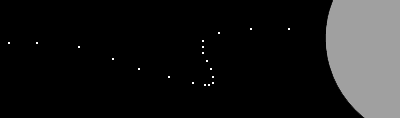

# p5.pathRecorder

#### record, save, and recall animation paths for your p5.js sketches!

p5 path recorder is a call which contains data of an animation path. there are various methods to interact, recall, store, and save paths. This library is meant to speed up animations and make simple non-mathematical animations easier to use and replicate. The library is designed to work in both 2d and 3d (WEBGL) modes of p5.js

## examples
##### 2d coordinate example   
[github pages](http://)  
[p5 web editor](http://)   

##### 3d coordinate example   
[github pages](http://)  
[p5 web editor](http://)   

## Table of Contents
##### Core
  + [p5pathRecorder class](#p5pathRecorder)
  + [.recordFrame()](#recordFrame)
  + [.play()](#play)


##### Utility
  + [.buffer](#buffer)
  + [.speed](#speed)
  + [.clear()](#clear)
  + [.startLocation()](#startLocation)
  + [.showPaths()](#showPaths)

##### Save & Recall
+ [.save()](#save)
+ [.load()](#load)


#### p5pathRecorder class
###### p5pathRecorder()
instantiate a new path recorder
```javascript
let recorder;

function setup() {
  recorder = new p5pathRecorder(); //instantiate a new path recorder
}
```
#### .recordFrame()
###### .recordFrame(x,y,[z])
records a frame of location data to the internal buffer
```javascript
let recorder;

function setup() {
  recorder = new p5pathRecorder(); //instantiate a new path recorder
}

function draw(){
  if(mouseIsPressed){ //only record then the mouse is being pressed
    recorder.recordFrame(mouseX, mouseY); // capture this frames mouse position
  }
}
```

#### .play()
plays back the buffer and return the value of the current frame. Returns an object with recorded x,y,[z] coordinates from the current location in the internal buffer. returns an object containing 0's if the buffer is not filled
###### example of returned object: ``{"x":100,"y":100,"z":100}`` or p5.vector if not recalled from JSON.
```javascript
let recorder;

function setup() {
  recorder = new p5pathRecorder(); //instantiate a new path recorder
}

function draw(){

  let pos = recorder.play() //play back the recording ()

  if(mouseIsPressed){
    recorder.recordFrame(mouseX,mouseY) //record a frame to the buffer
  }else{
    //dont draw the ellipse while recording.
    ellipse(pos.x, pos.y, 100, 100)
  }
}
```

#### .buffer
an internal variable containing the animation buffer (an array)
```javascript
let recorder;

function setup() {
  recorder = new p5pathRecorder(); //instantiate a new path recorder
  console.log(recorder.buffer); //see the contents of the buffer
}
```

#### .speed
an internal variable which sets the playback speed (default: 1)
```javascript
let recorder;

function setup() {
  recorder = new p5pathRecorder(); //instantiate a new path recorder
  recorder.speed = 0.5 ; //set playback to half speed
}
```

#### .clear()
clears the internal buffer
```javascript
let recorder;

function setup() {
  recorder = new p5pathRecorder(); //instantiate a new path recorder
}

function keyPressed(){
  recorder.clear() // clear the buffer
}
```

#### .startLocation()
###### .startLocation(position)
starts the buffer playback at a specific location (cannot exceed the size of the buffer)
```javascript
let recorder;

function setup() {
  recorder = new p5pathRecorder(); //instantiate a new path recorder
}

function draw(){
  if(mouseIsPressed){ //only record then the mouse is being pressed
    recorder.recordFrame(mouseX, mouseY); // capture this frames mouse position
  }
}

function keyPressed(){
  recorder.startLocation(30) //re-start the buffer at the 30th frame
}
```

#### .showPaths()
Visual display of the path of the animation, useful for debugging and feedback
```javascript
let recorder;
function setup() {
  recorder = new p5pathRecorder(); //instantiate a new path recorder
}
function draw(){
  recorder.showPaths(); //show the path of the recording using points
}
```

#### .save()
###### .save('filename')
Save the paths out to an external JSON file for later recall and archiving.
```javascript
function keyPressed(){
  recorder.save('myPaths') //save out the paths to an external json file
}
```

#### .load()
###### .load('path/to/data.json')
Load paths which were previously saved into the internal buffer
```javascript
let recorder; //make a variable for the path recoder class to exist in

function setup() {
  recorder = new p5pathRecorder(); //instantiate a new path recorder
  recorder.load('myPaths.json') //load some existing paths from a file
  // console.log(recorder.buffer) //see the paths buffer
}
```
